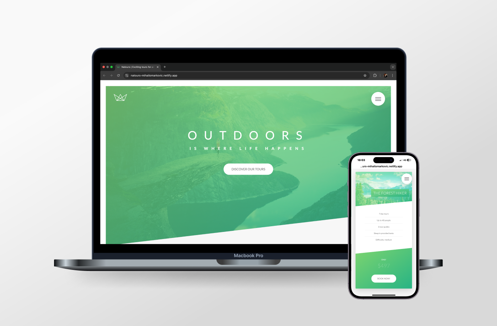

# [Natours Project 🌲](https://natours-mihailomarkovic.netlify.app/)

## Introduction

Welcome to the Natours Repository, a project built to explore advanced layout and animation techniques using HTML, CSS, and SASS. This project focuses on showcasing creative design solutions, such as flipping cards, animated navigation menus, and a beautifully styled form section.

This project serves as a milestone in my journey as a developer, highlighting my ability to use CSS float layouts and animations effectively.

## Project Highlights

- **CSS Float Layouts:** The foundation of this project was built using CSS floats for layout design, reinforcing an understanding of traditional layout techniques.
- **Engaging Animations:** Features include flipping cards and smooth navigation animations, making the site interactive and visually appealing.
- **Responsive Design:** Adapted for seamless usability across a range of devices, from desktops to mobile phones.

## What I Learned

This project allowed me to gain hands-on experience in several key areas:

### HTML

- Structuring content logically for clear readability and SEO optimization.
- Using semantic tags to enhance accessibility and maintain clean code organization.

### CSS & SASS

- Float-based layouts to understand traditional positioning techniques.
- Advanced animations, including card flipping and smooth transitions.
- Leveraging SASS for better organization and maintainability of styles.

### Design Principles

- Implementing modern design elements like consistent spacing, elegant typography, and cohesive color schemes.
- Creating user-friendly interfaces with a focus on clarity and engagement.

### Problem-Solving

- Debugging layout challenges with floats.
- Perfecting card flipping animations for a smooth and natural look.

## Project Features

The Natours website is a creative and interactive project designed to highlight key elements of modern web design:

- **Animated Navigation Menus:** Smoothly animated menus add polish and interactivity.
- **Flipping Cards:** Visually dynamic card-flipping animations create an engaging user experience.
- **Form Section:** Styled with precision to ensure usability and aesthetic consistency.
- **Responsive Layouts:** Desktop-first design guarantees accessibility across all devices.

Together, these features reflect an intentional approach to design and functionality, blending creativity with technical skills.

## Technologies Used

- **HTML5:** For clean, semantic markup.
- **CSS3:** For styling, animations, and layouts using floats.
- **SASS:** To improve CSS organization and maintainability.

## Closing Thoughts

The Natours project showcases my growth as a developer, from mastering CSS float layouts to implementing visually captivating animations. It reflects my commitment to building responsive and engaging web experiences while learning and applying best practices.

Thank you for exploring this repository. Please feel free to check out the code and visit the live site. Your feedback is always appreciated!
